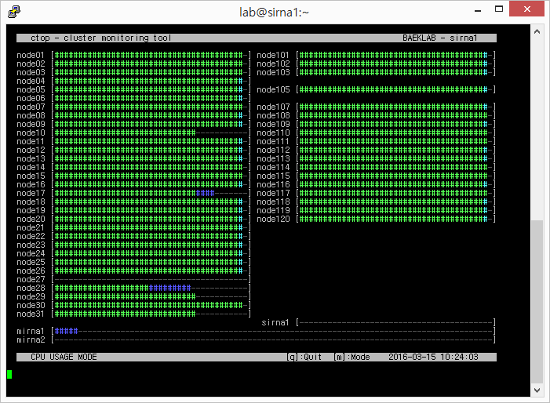
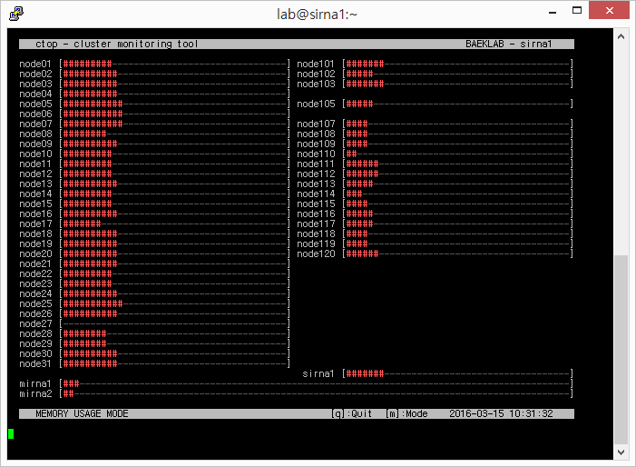

# ctop
bash script for monitoring cluster nodes

Screenshot - CPU usage mode

Screenshot - Memory usage mode

Type 'm'(change mode) to switch to memory usage mode

Retype 'm' to return to CPU usage mode
